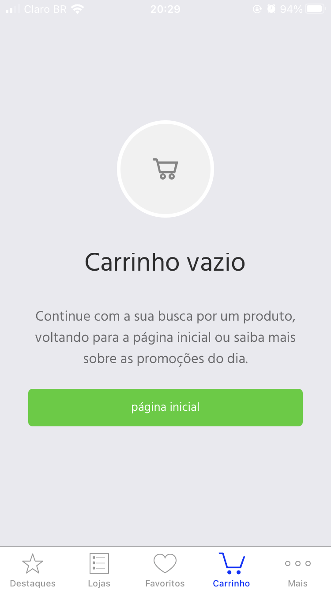
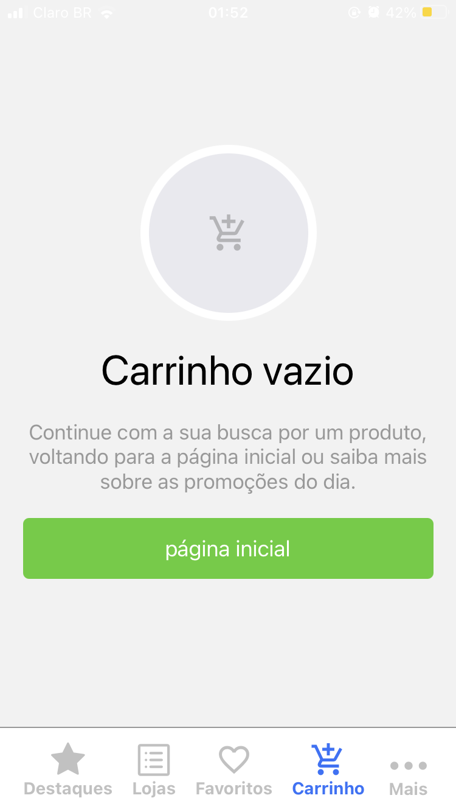
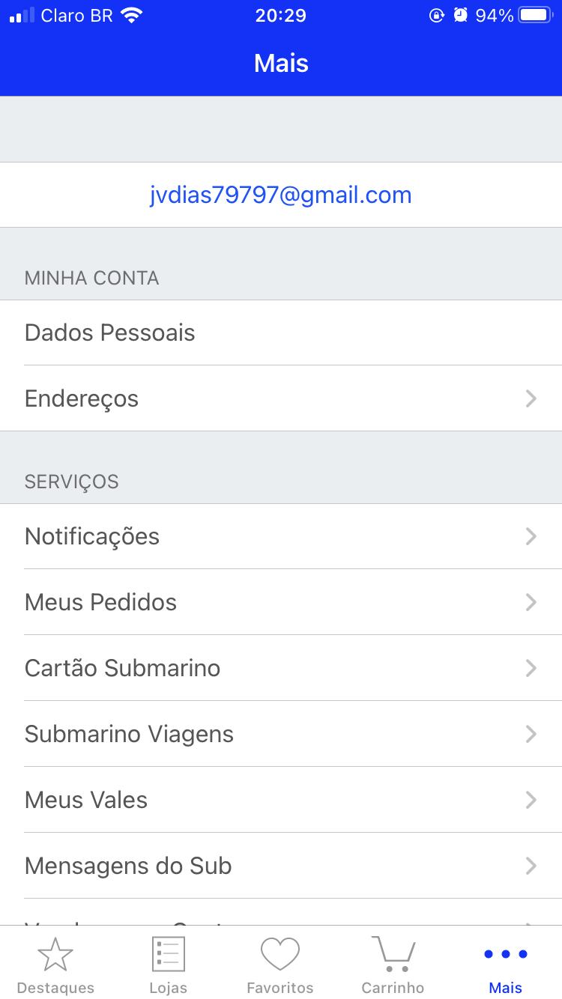
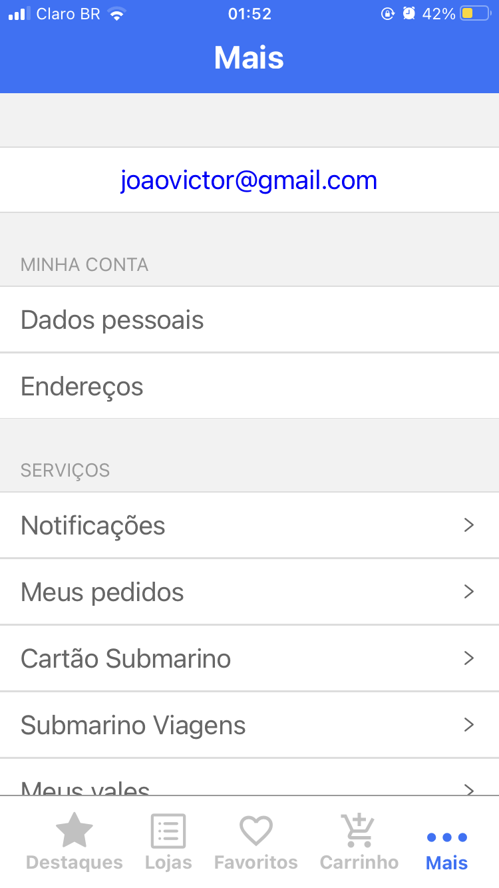

#  UI Clone Submarino

### The idea is clonning UI of [Submarino](https://www.submarino.com.br/) mobile version. This project only implements an UI clone, meaning there's no anything functional, also buttons to navigate between screens.

## 🚀 Techs

- [TypeScript](https://www.typescriptlang.org/)
- [ReactJS](https://reactjs.org/)
- [React Native](https://reactnative.dev/)
- [Styled Components](https://styled-components.com/)
- [Yarn](https://yarnpkg.com/)
- [Expo vector icons](https://icons.expo.fyi/)

### 📈 How contributing?
- Fork this repository;
- Create a branch with your feature: `git checkout -b my-feature`
- Commit changes: `git commit -m 'feat: My new feature'`
- Push branch: `git push origin my-feature`

### Comparation

- Destaques: Coming soon.

- Lojas: Coming soon.

- Favoritos: Coming soon.

___
- Cart:

| Original | Clone  |
|----------|--------|
|          |        |
|||

- More:

| Original | Clone  |
|----------|--------|
|          |        |
|||
